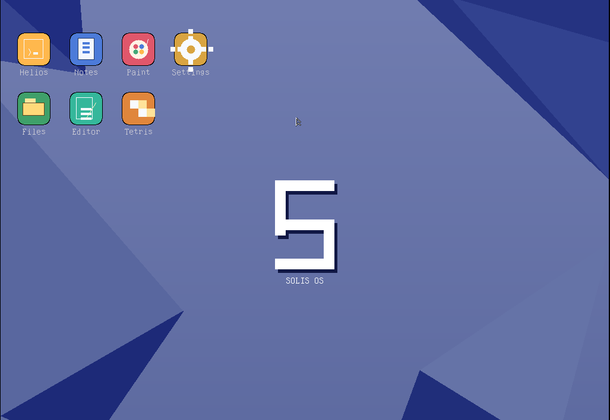
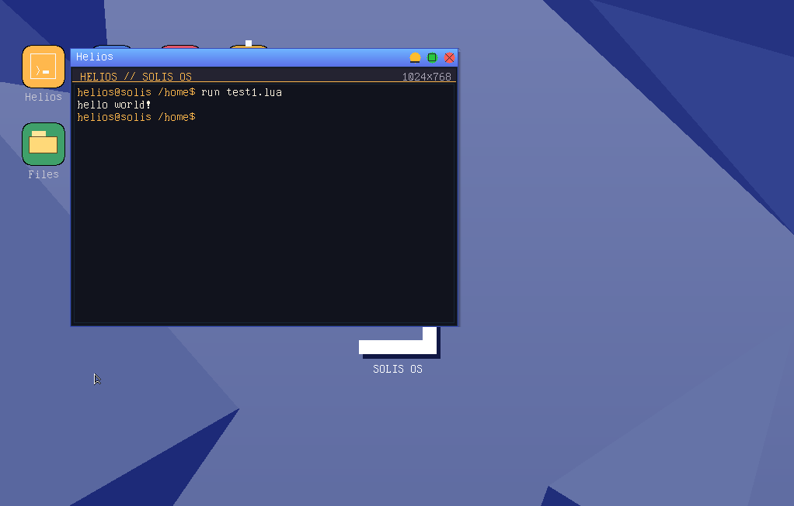

# Solis OS

Solis is a 32-bit hobby operating system for x86 (i386). It boots with GRUB
(Multiboot2), draws a GUI desktop through a VBE framebuffer, and ships a small
set of built-in applications. It is written in freestanding C with no libc, and
is primarily developed and run inside QEMU.

## Why the name Solis?

Solis is inspired by the Latin word for "sun." I liked the image of the sun
shining over Rome: a steady source of light, energy, and possibility. That
connection is a bit of personal mythology for the project, not a claim that
Solis is a historical Roman name. For me, it gives the OS a bright, forward-
looking identity while nodding to the old world.

## Philosophy

Solis is built as a hands-on exploration of how an operating system works,
from booting and hardware drivers to the desktop and applications. Its goal is
to be approachable, self-contained, and fun to shape: a place to experiment,
learn, and make a computing environment feel personal.

Unix and Linux have deep histories, mature ecosystems, and design ideas that
have influenced operating systems everywhere, including this project. Solis
isn't trying to replace them or claim to be a better Unix. The difference is
mostly one of purpose and scale: Solis is a small hobby OS developed as a
cohesive project, where I can build and understand each layer myself, rather
than a general-purpose system intended to support the breadth of hardware,
software, users, and workflows that Linux and Unix-like systems serve.

## About the creator

I'm Luis, the creator of Solis. I've been obsessed with technology since I was
little, always curious about how computers work and what you can make with
them. Solis brings that curiosity into one long-running project: building an
operating system from the ground up, learning by doing, and turning ideas into
something I can boot, explore, and keep improving.

## Stability status

Solis is **partially stable**. It boots reliably and the desktop, apps, and
filesystem work in everyday use, but it is a hobby OS that has **not been
tested to its full extent**:

- There is **no installer yet** — Solis currently runs from the ISO/disk
  images built by `make` inside an emulator (QEMU) or VM.
- It has not been validated on a wide range of real hardware.
- Expect occasional bugs and rough edges.

## Features

- **Boot**: GRUB 2 / Multiboot2, 1024x768x32 VBE framebuffer
- **GUI**: Desktop, window manager, floating taskbar with pinned launchers and
  a system tray, and an app grid
- **Redraw engine**: Entity-based GUI rendering that treats desktop elements,
  windows, taskbar, mouse, and other GUI components separately and redraws
  only the entities that have changed
- **Themes**: Gnome, Sunset, Cherry Blossom, Starfield, and solid colors
- **Apps**: Helios, Notepad, Paint, Settings, Files, Task Manager, SOLPKG, Editor, Tetris
- **Languages**: Built-in C and Lua compilers/interpreters, with source runners
  available through Helios
- **Filesystem**: SOLFS on an ATA (IDE) disk, plus a small VFS
- **Networking**: RTL8139 driver with ARP, ping, DNS, and HTTP client support
- **Input**: PS/2 keyboard + mouse, and an I2C touchpad driver
- **Time**: CMOS real-time clock driver with a selectable timezone and a
  syscall API usable by applications (see below)

## Screenshots

### Solis OS desktop



### Helios terminal


### Lua execution



## Applications

Solis ships with nine built-in apps. They are compiled as freestanding
binaries, wrapped in the SPX package format, and embedded in the kernel. They
can be launched from the desktop icons, the taskbar's pinned launchers, or the
Apps grid (the launcher button on the left of the taskbar):

| App | What it does |
|--------------|---------------------------------------------------------------------|
| **Helios** | Interactive shell with filesystem commands plus Lua and C source runners |
| **Notepad** | Plain-text editor with save/load |
| **Paint** | Pixel drawing canvas with a palette and brush tools |
| **Settings** | Theme/wallpaper, background color, and timezone configuration |
| **Files** | Browse the SOLFS disk |
| **Task Manager** | Live CPU load graph and process list |
| **SOLPKG** | Package manager for the SOLPKG repo |
| **Editor** | Source code editor with C syntax highlighting (Ctrl+S save, Ctrl+N new) |
| **Tetris** | Classic falling-blocks game |

## Using the desktop

- Click a **desktop icon**, a **taskbar** launcher, or open the **Apps grid**
  to launch an app. Windows can be dragged by their title bar.
- Each window has **minimize**, **maximize**, and **close** buttons (top
  right) that stay flat until hovered; windows cast a soft drop shadow.
- The **taskbar** is a floating rounded card at the bottom: the launcher on
  the left, pinned app launchers plus a button per open window in the middle
  (a dot marks apps that are running), and the tray with RAM, date, and a
  live clock on the right. Click a window button to focus, minimize, or
  restore it; pinned launchers shrink automatically when many windows are
  open.
- The **Settings** app changes the theme and background in real time.
- **Settings > Time & Date** changes the clock timezone and saves it for the next boot.
- Helios supports `lua file.lua`, `cc file.c`, and `run file.lua` or `run file.c`.

## Minimum system requirements

Solis is a lightweight 32-bit OS, but it still expects a specific hardware
environment. These are the minimums to run it (the defaults used by the
`make run` QEMU setup):

- **CPU**: 32-bit x86 (i386 or newer); one core is enough
- **RAM**: 256 MB
- **Graphics**: VBE-capable display adapter able to provide a
  1024x768x32 framebuffer mode
- **Storage**: an ATA (IDE) disk for the SOLFS file system
- **Input**: a PS/2 keyboard and PS/2 mouse (I2C touchpad is optional)
- **Network** *(optional)*: an RTL8139 Ethernet card for networking
- **Boot**: GRUB 2 with Multiboot2 support

The recommended way to run Solis today is inside QEMU (see
[Running](#running)) — no installer is required there.

## Requirements (for building)

The build targets i386 (`-m32`) and needs the usual OS-dev toolchain. On
Fedora, install the following (VirtualBox is optional, only for `make vbox-disk`):

```sh
sudo dnf install -y \
  gcc glibc-devel.i686 libgcc.i686 make \
  qemu-system-x86 grub2-tools xorriso mtools
```

Other distros: `gcc-multilib` + `qemu-system-i386` + `grub-pc-bin` +
`xorriso` + `mtools` (Debian/Ubuntu) or the equivalent `-m32` capable toolchain.

### Windows

The kernel must be linked as ELF i386 (`ld -m elf_i386`). MSYS2 UCRT64 and
MinGW GCC produce Windows PE/COFF objects, so they can compile individual
files but cannot link this kernel. Use WSL for the complete build:

```powershell
wsl --install -d Ubuntu
```

Inside Ubuntu/WSL:

```sh
sudo apt update
sudo apt install build-essential gcc-multilib binutils grub-pc-bin \
  xorriso mtools qemu-system-x86 python3

cd /mnt/d/MyOS

make
```

An `i686-elf-gcc` cross-toolchain is also suitable. MSYS2 may still be used
for editing, but its UCRT64 linker is not suitable for the kernel link step.

## Building

```sh
make            # builds build/solis.iso and the package-disk SPX files
make build/disk.img  # also build the SOLFS disk image (built automatically by make run)

make clean      # removes build artifacts
```

The kernel and every application are compiled into a single ISO, and the nine
built-in apps are embedded in the kernel as SPX packages.

## Running

Run in QEMU (default VGA):

```sh
make run
```

Other targets:

```sh
make run-serial      # logs kernel serial output to serial.log
make run-nographic   # headless (serial console)
make run-dbg         # serial to stdio with a user-mode NIC
make vbox-disk       # convert build/disk.img to build/solis.vdi for VirtualBox
```

The default QEMU invocation boots the ISO with the pre-loaded package disk
attached as an IDE drive. Networking uses QEMU's user-mode NIC with an RTL8139
model (`-nic user,model=rtl8139`).

## Clock & timezones

Solis reads the date/time from the CMOS real-time clock and treats it as UTC,
then applies the selected timezone offset. The current time is shown live in
the taskbar tray. To change the timezone:

1. Open **Settings** (desktop icon, taskbar launcher, or the Apps grid).
2. Go to the **Time & Date** tab.
3. Click a timezone (e.g. *Chicago*, *New York*, *London*, *Tokyo*).

The selection applies immediately to the whole system. It is kept in memory,
so it resets to UTC on reboot.

### RTC API

The time API is exposed to applications through the syscall table (see
`include/solis/syscall.h`). Kernel side lives in `kernel/rtc.c` and apps reach
it through the wrappers in `apps/glue.c`.

```c
#include <solis/rtc.h>

struct rtc_time t;

rtc_get_time(&t);                 /* fills t with local time + date        */
rtc_set_timezone(3);              /* switch to Chicago (UTC-6)             */
int  tz = rtc_get_timezone();     /* index of the active timezone          */
int  n  = rtc_get_timezone_count();
rtc_get_timezone_name(i, buf, n); /* copy a timezone's name into buf       */
int  off = rtc_get_timezone_offset(i); /* minutes east of UTC for zone i   */
```

`struct rtc_time` fields: `second`, `minute`, `hour`, `day`, `month`, `year`,
`weekday` (0 = Sunday .. 6 = Saturday), `tz_offset` (minutes east of UTC) and
`tz_index` (selected timezone index). Timezone offsets are fixed; daylight
saving is not applied.

## Project layout

```text
boot/             boot.S + GRUB config
kernel/           core kernel: console, gdt/idt/pic, keyboard/mouse, RTC,
                  graphics (VBE), timer (PIT), ATA, SOLFS/VFS, SPX package
                  loader, PCI + RTL8139 networking
gui/              desktop shell (windows, taskbar, app grid, login)
window_manager/   thin facade over the GUI
desktop/          desktop init/redraw
apps/             built-in SPX applications + syscall glue
pkg/              packaged apps (taskmanager, solpkg) and the SOLPKG repo
                  metadata
tools/            build helpers (mkspx.py, mksolfs.py) and a test HTTP server
include/solis/    public headers shared by the kernel and applications
```

## License

[Apache 2.0](LICENSE)
